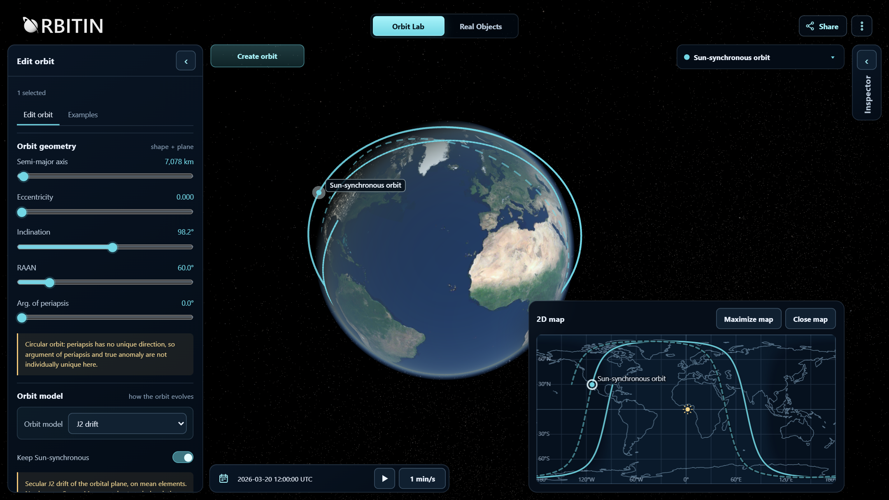
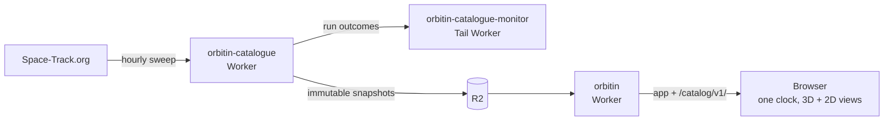

# Orbitin

[](https://github.com/Varjola/orbitin/actions/workflows/ci.yml)

Orbitin is an interactive 3D Earth and 2D ground-track map for learning
orbital mechanics. It runs in the browser at [orbitin.net](https://orbitin.net).



It has two modes. **Orbit Lab** holds conceptual Keplerian orbits that are
edited directly, propagated as ideal two-body orbits or with J2 secular drift.
**Real Objects** propagates published element sets from a Space-Track.org
catalogue with SGP4/SDP4. Scenes can be shared as links or files. The
interface is in English and Finnish.

## Limitations

Orbitin is for education and visualization. It is not suitable for
conjunction assessment or operational decisions. [Models and
limitations](docs/models-and-limitations.md) describes what each model
includes and leaves out, and how accurate real-object positions can be.

## Technical decisions

- **No framework and no general backend.** TypeScript and
  [three.js](https://threejs.org/) in the browser, Vite for the build,
  [satellite.js](https://github.com/shashwatak/satellite-js) for SGP4. There
  are no accounts and no server-side user state.
- **Mechanics separate from rendering.** `src/core`, `src/orbital` and
  `src/simulation` never import three.js, the interface or application state.
  `src/app/sourceArchitecture.test.ts` reads the import graph and enforces the
  layering.
- **One clock, one propagation per frame.** Each frame computes the
  environment (Sun direction, Earth orientation) once and propagates each
  object once. The 3D view, the 2D map and the readouts all draw from that
  one result; the map never propagates.
- **One immutable state store.** `AppState` changes only through pure action
  functions that return the next state.
- **The catalogue is built on a schedule, not in the browser.** Only the
  producer Worker contacts Space-Track.org. It fetches one bounded page of GP
  element sets per hourly run and, when the sweep is complete, publishes an
  immutable snapshot to R2: a manifest, a search index and up to 256 record
  shards, each with its SHA-256. The `current.json` pointer is written last,
  so a failed run leaves the previous snapshot in use.
- **The browser verifies what it loads.** The catalogue is loaded only on
  request, checked against the hash chain and searched locally. Record shards
  are fetched only when a record is shown or added.
- **Least privilege between Workers.** The frontend Worker holds no secrets,
  reads the bucket only and serves an allowlist of exact paths. Provider
  credentials exist only in the producer. A Tail Worker watches the
  producer's runs.
- **Scene links live in the URL fragment.** A compact binary encoding (`s1`),
  optionally compressed, in `#scene=`. The fragment is never sent to the
  server. Every opened link or file is validated completely, with bounded
  sizes and counts.
- **Two presentations over one state.** A media query selects the desktop or
  the phone interface; switching rebuilds only the interface, not the scene,
  clock, camera or loaded catalogue.
- **Localization checked by tests.** The Finnish message catalogue must match
  the English one key for key.



[docs/architecture.md](docs/architecture.md) describes the layers, the data
flow and the catalogue pipeline.

## Running locally

Requirements: Node.js 24 and Git.

```text
npm ci
npm run dev
```

The development server serves a local, synthetic satellite catalogue inside
the page, so Real Objects works without an account or a Worker.

Checks, as run in CI:

```text
npm run typecheck
npm run typecheck:worker
npm run test:run
npm run build
npm run test:deployment
npm run test:versioning
```

The Vitest suite checks the mechanics against published references (SGP4
verification cases, JPL Horizons Sun positions, the Meeus precession example),
the catalogue producer against mocked provider transcripts, the scene link and
file codecs, and the architecture rules above.

## Repository layout

| Path | Contents |
| --- | --- |
| `src/` | The browser application and its tests |
| `workers/` | The frontend Worker, the catalogue producer, its monitor and shared serving code |
| `docs/` | Technical documentation |
| `public/` | Textures, star and map data, icons, headers |
| `scripts/` | Asset bakes, build and deployment checks |
| `assets-source/` | Provenance notes for shipped assets |

## Documentation

- [Architecture](docs/architecture.md)
- [Models and limitations](docs/models-and-limitations.md)
- [Real Objects: OMM and the published catalogue](docs/catalogue-and-omm.md)
- [TLE, OMM and SGP4](docs/tle-and-sgp4.md)
- [J2 drift](docs/orbit-perturbation-model.md)
- [Time, Sun and Earth orientation](docs/environment-model.md)
- [Ground tracks](docs/ground-track-model.md) and [the 2D map](docs/ground-track-map.md)
- [Sensor footprints](docs/sensor-footprint-model.md)
- [Modes and scenes](docs/modes-and-scenes.md) and [sharing scenes](docs/scene-sharing.md)
- [The phone presentation](docs/mobile.md)
- [Localization](docs/localization.md)
- [Deploy your own](docs/deploy-your-own.md)
- [Privacy](docs/privacy.md)

## Versions

The repository-root [`VERSION`](VERSION) file is the only manually maintained
version; `package.json` must match it. The build injects it together with the
Git revision, and the interface shows it in About, linked to the overview at
[orbitin.net/changelog](https://orbitin.net/changelog). The detailed history
is in [CHANGELOG.md](CHANGELOG.md).

## Project status

Orbitin is a personal project. Bug reports are welcome as
[GitHub issues](https://github.com/Varjola/orbitin/issues), and forks are
welcome under the licence. See [CONTRIBUTING.md](CONTRIBUTING.md) and, for
security reports, [SECURITY.md](SECURITY.md).

## Licence and attribution

The source code is released under the [MIT License](LICENSE). Third-party data
and imagery keep their own terms: orbital data from USSPACECOM / 18th Space
Defense Squadron, accessed via Space-Track.org; Earth imagery from NASA; the
Milky Way from NASA/Goddard SVS and ESA/Gaia/DPAC; stars from the HYG
Database (CC BY-SA 4.0); coastlines and borders from Natural Earth. Details
are in [ATTRIBUTION.md](ATTRIBUTION.md).
