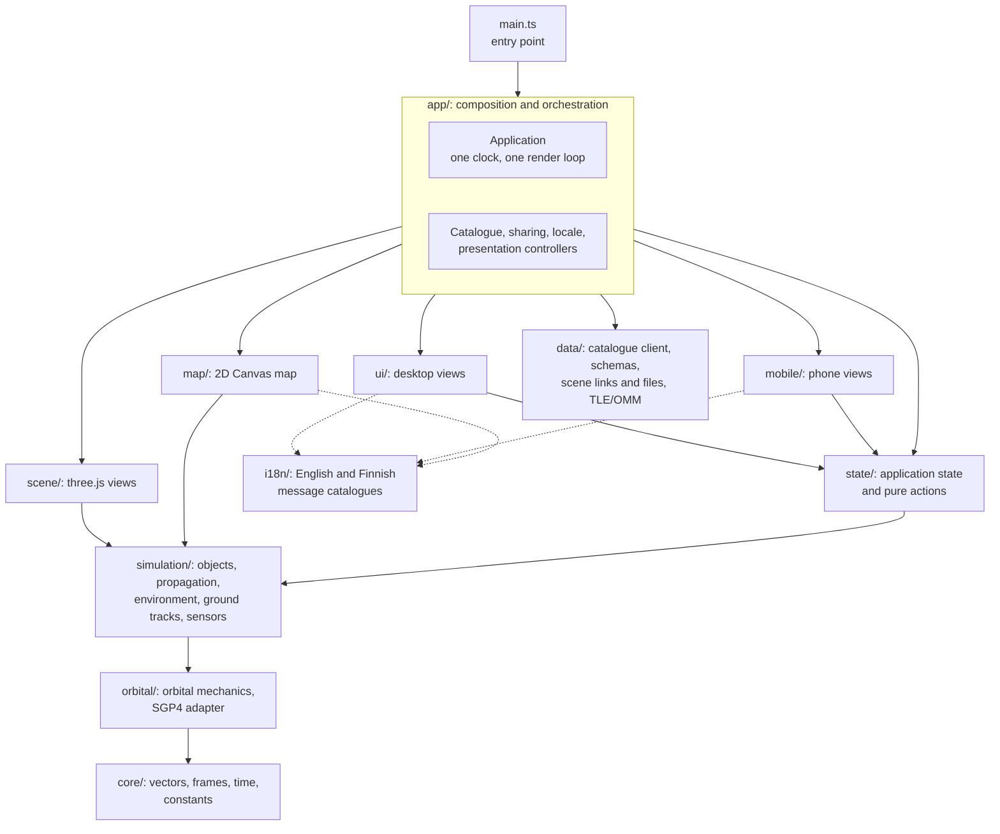
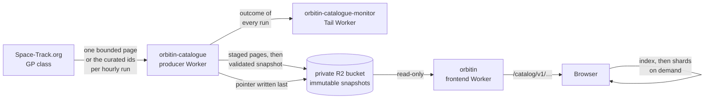

# Architecture

Orbitin is a single-page TypeScript application rendered with three.js,
served by a Cloudflare Worker together with a published satellite catalogue.
A second Worker builds that catalogue on a schedule, and a third watches it.
There are no accounts, no server-side user state and no general backend.

## The application in layers

Dependency rules, enforced by `src/app/sourceArchitecture.test.ts`, which reads
the import graph:

- `core/`, `orbital/` and `simulation/` never import three.js, the
  interface or application state. The mechanics can be tested and reasoned
  about without a renderer.
- `map/` is a view over data it is handed: it imports only `core/`,
  `simulation/` and `i18n/`, owns no propagator and no state, and draws inside
  the one render loop.
- `mobile/` uses the shared state, data and wording only; it never imports a
  desktop view. Desktop views never import mobile ones.
- Sensor geometry cannot propagate or orient Earth itself: the runtime hands
  it the frame's one propagated state and Earth orientation.
- Nothing in the browser can reach a catalogue provider: every catalogue read
  is same-origin, and provider names and credentials appear only in the
  producer Worker.

### Mode, catalogue, scene, selection

The interface is built around four ideas, in this order:

1. **Mode.** *Orbit Lab* holds editable conceptual orbits; *Real Objects*
   holds catalogue objects and pasted TLE or OMM records. Each mode keeps its
   own scene while the page is open.
2. **Catalogue.** The published satellite catalogue is loaded only when the
   learner asks for it, never automatically.
3. **Scene.** Up to 100 objects per mode, each with its display layers
   (orbit path, ground track, recorded history, sensor geometry).
4. **Selection.** One primary object and optional companions; the inspector
   and the object card show the primary.

State lives in one immutable `AppState` store (`state/AppState.ts`). Pure
action functions return the next state; `Application.commitState` applies it,
reconciles the runtime and republishes the interface.

### One clock, one publication, two views

A single `SimulationClock` advances once per animation frame. Each frame:

1. the environment (Sun direction, Earth orientation) is computed for the
   frame's instant;
2. `OrbitalObjectRuntime` propagates every object once and publishes one
   sample per object: position, velocity, the sub-satellite point and, if
   shown, the sensor geometry;
3. the 3D scene and the 2D map both draw from that publication. The map never
   propagates anything itself.

Readouts in the interface come from the same frame's sample and are stored
nowhere.

### Presentations

A media query chooses the **desktop** or the **phone** presentation at load
and when the window crosses it. Both are complete interfaces over the same
application state, scene, clock and catalogue client. Switching rebuilds only
the interface; the scenes, the clock, the camera and the loaded catalogue stay.

### Localization

Every word the interface shows comes from a message catalogue in
`src/i18n/messages/` (English and Finnish). The Finnish catalogue must match
the English one key for key; tests enforce this. A language change rebuilds the
interface in place. See [localization.md](./localization.md).

### Sharing

A scene is shared as a link whose fragment (`#scene=s1.…`) holds the
compressed scene, or as a JSON scene file. The fragment is never sent to the
server. Opening validates the whole document, asks before replacing a scene,
and resolves catalogue objects by NORAD number against the newest published
element sets. See [scene-sharing.md](./scene-sharing.md).

## The catalogue pipeline

- The **producer** (`workers/catalogue/`) is the only code that contacts the
  provider. Each hourly run fetches one page of current GP element sets,
  stages it privately, and continues from its cursor. When the sweep is
  complete, the next hourly run fetches the curated group members and featured
  picks it lacks (`src/data/curatedCatalogue.ts`, element sets up to 30 days
  old), then the whole candidate is validated, enriched with derived orbit
  classes and published as an immutable snapshot: a manifest, a search index
  and up to 256 record shards, each with its SHA-256. The `current.json`
  pointer is written last, so a failed publication leaves the previous
  snapshot in use.
- The **frontend Worker** (`workers/frontend/`) serves the built application
  and an allowlist of exact catalogue paths from the bucket, with the pointer
  short-lived and snapshot parts immutable. It also accepts the anonymous
  usage events described in [privacy.md](./privacy.md). It holds no secrets
  and cannot write the bucket by design.
- The **monitor** (`workers/catalogue-monitor/`) is the producer's Tail Worker.
  It binds only its own bucket and holds no provider secret. It e-mails the
  operator when a producer run crashes or the producer stops running; the
  producer itself e-mails about conditions it can see. Both are optional and
  off without their secrets.
- The **browser** (`src/data/CatalogueClient.ts`) loads the pointer, the
  manifest and the search index only when asked, verifies every part against
  the hash chain, searches locally, and fetches a record shard only when a
  record is shown or added.

Details: [catalogue-and-omm.md](./catalogue-and-omm.md) and
[environment-model.md](./environment-model.md).

## Repository layout

| Path | Contents |
| --- | --- |
| `src/app/` | Composition root (`Application.ts`), controllers, the render loop, anonymous usage events |
| `src/core/` | Vectors, matrices, reference frames, time, constants |
| `src/orbital/` | Keplerian geometry, element conditioning, the satellite.js SGP4 adapter |
| `src/simulation/` | Orbital objects, propagation models, environment, ground tracks, sensor geometry |
| `src/state/` | Application state and its pure actions |
| `src/data/` | Catalogue schema and client, search, official groups, scene documents, links and files, TLE and OMM parsing |
| `src/scene/` | three.js views: Earth, atmosphere, Sun, orbit paths, markers, picking |
| `src/map/` | The 2D ground-track map on Canvas |
| `src/ui/`, `src/mobile/` | Desktop and phone presentations |
| `src/i18n/` | Message catalogues and formatting |
| `src/starfield/`, `src/assets/` | Star field and texture loading |
| `workers/` | The frontend Worker, the catalogue producer, its monitor and their shared serving and alert code |
| `scripts/` | Asset bakes, build and deployment checks |
| `docs/` | Public technical documentation |
| `public/` | Files served as they are: textures, star data, map data, icons |

## Tests

The Vitest suite (`npm run test:run`) covers the mechanics against published
references (SGP4 verification cases, JPL Horizons Sun positions, the Meeus
precession example), the catalogue contract and producer with mocked provider
transcripts, the scene link and file codecs, every view's wording in both
languages, and the architecture rules above. `npm run test:deployment` checks
the Worker configurations, and `npm run build` fails if a development-only aid
would reach the production bundle.
